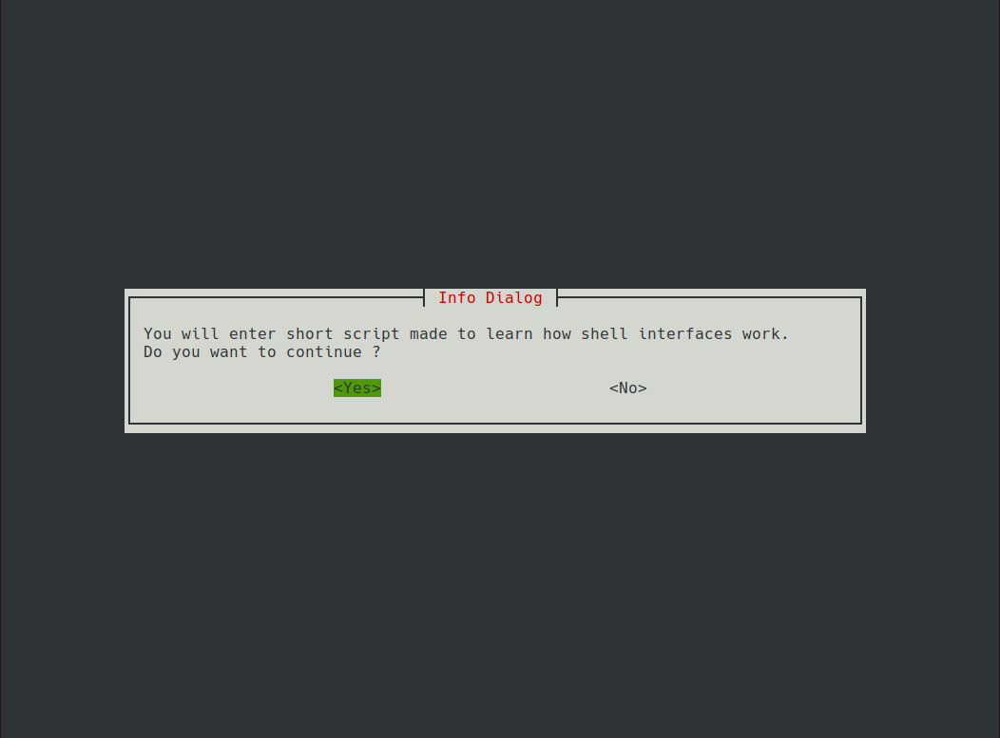
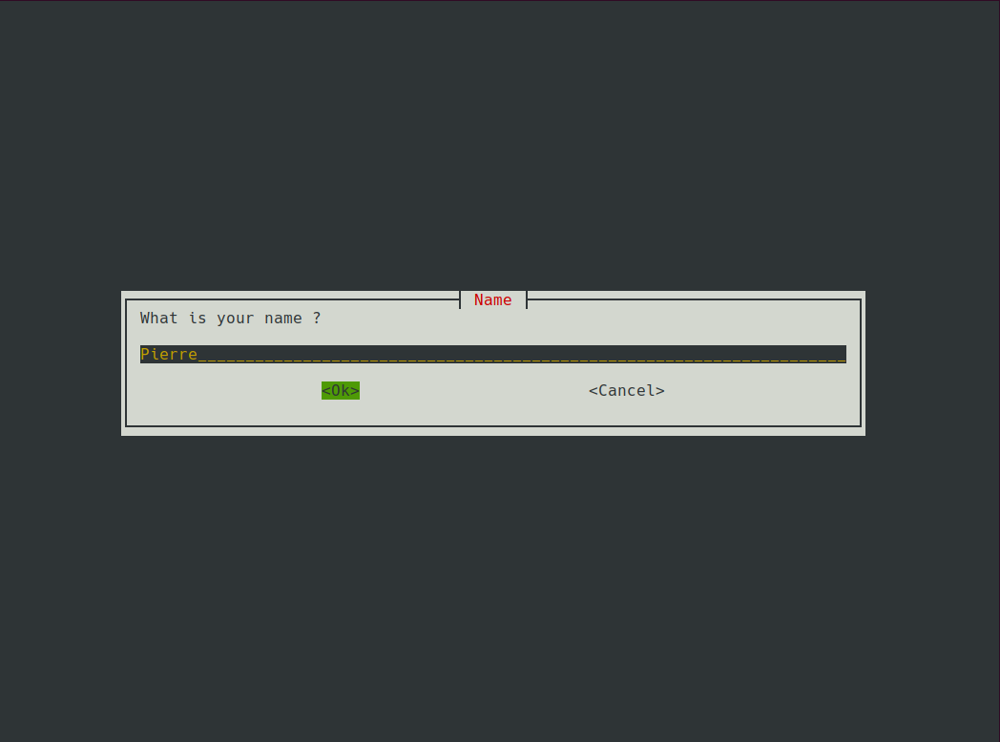
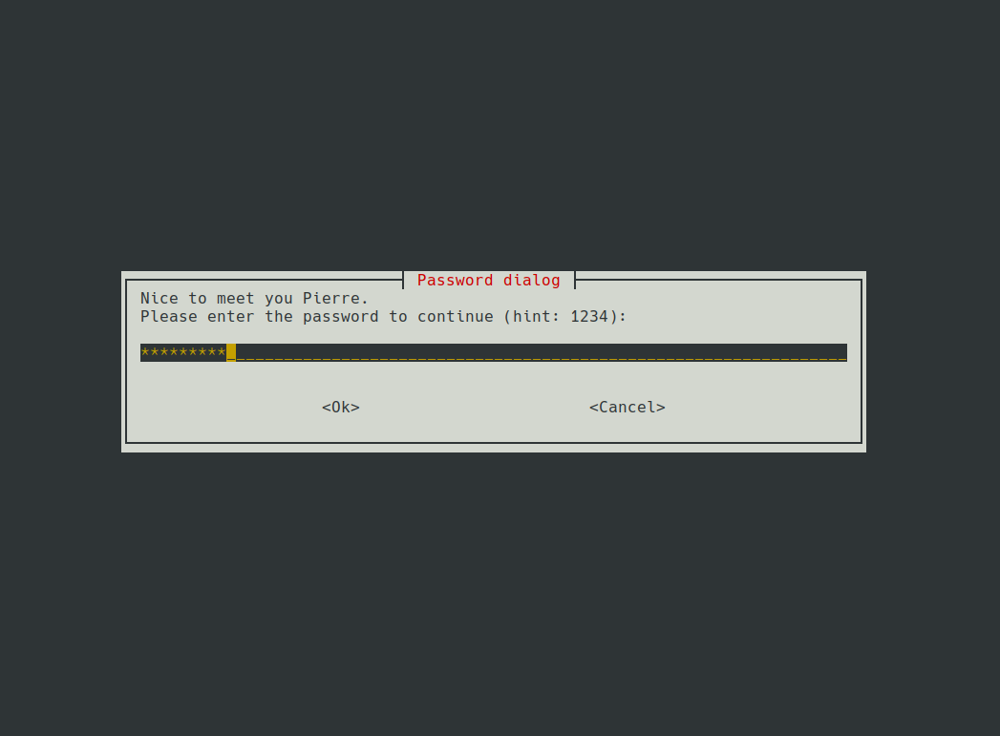
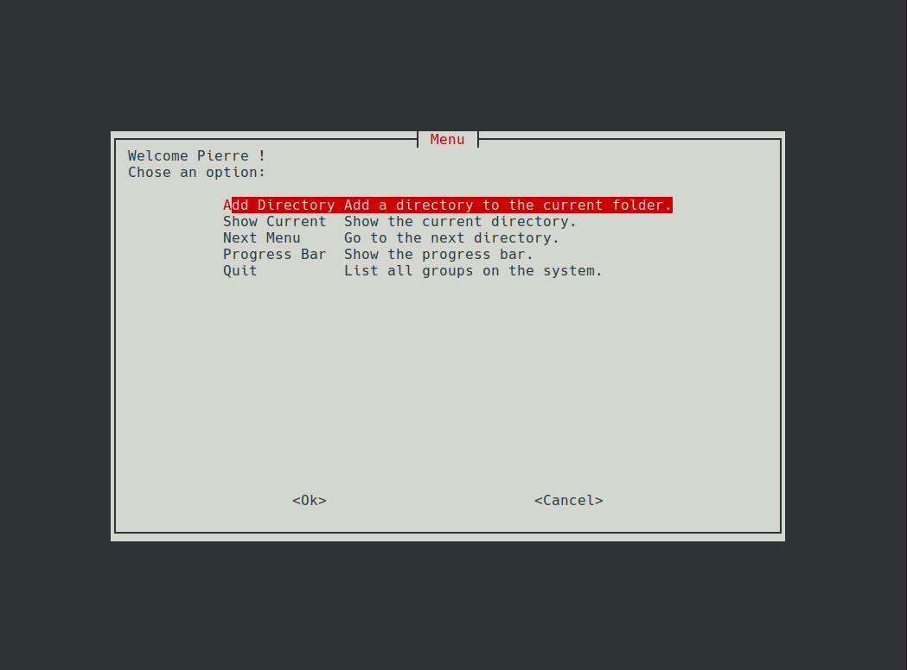

# Whiptail introduciton
 

It is a mini project made in bash and whiptail to experiment with interfaces in a shell environment.

## What does it do ?

Almost nothing really. It is just a test interface. The only real actions it can do are :
 * Create a directory (from the current folder). And print an error in case of failure.
 * Show the list of files in the current directory.

**Note :** The progress bar only displays information but doesn't do anything really.

## Images
The first message of the interface:

Name scree :

Password screen :

Menu screen :

## Ressources

To create this interface I mostly used the this page : https://en.wikibooks.org/wiki/Bash_Shell_Scripting/Whiptail  

Regarding the design I used the information from this page : https://askubuntu.com/questions/776831/whiptail-change-background-color-dynamically-from-magenta/781062#781062
